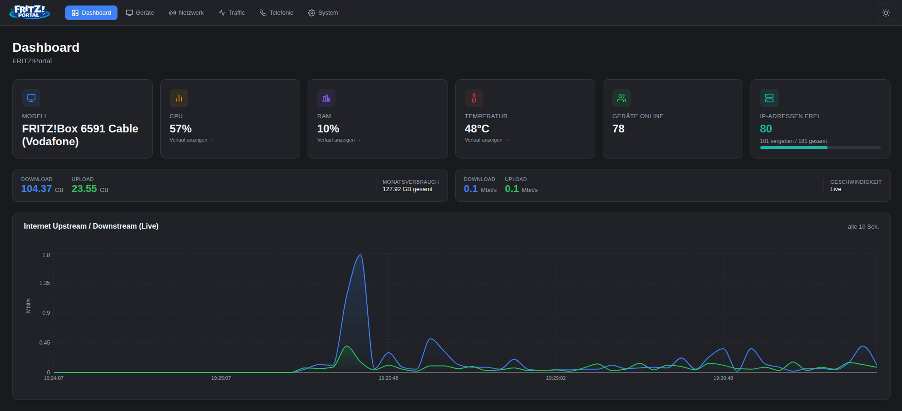
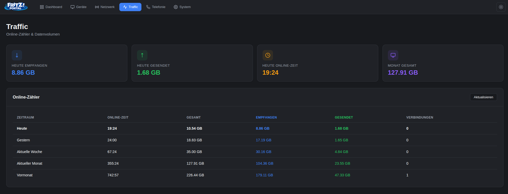
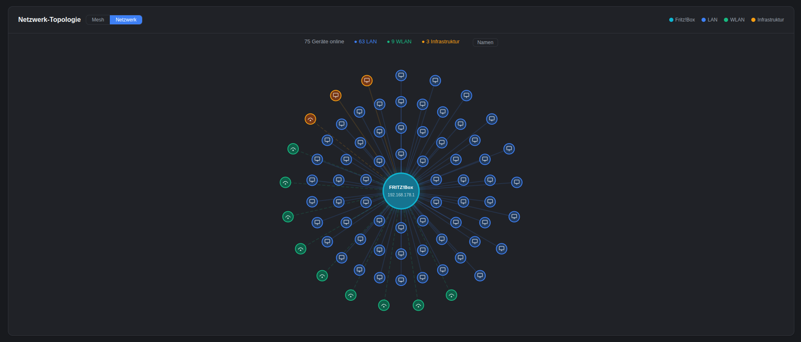

<p align="center">
  
</p>

<h1 align="center">FRITZ!Portal</h1>

<p align="center">
  <strong>The modern Fritz!Box dashboard as a Home Assistant Add-on</strong><br/>
  Real-time overview, network topology, HA sensors and more – all in one elegant interface. Easily rename devices, assign new IP addresses or block unwanted hosts directly from the add-on. Fully integrated into the Home Assistant UI via Ingress.
</p>

<p align="center">
  
  
  
  
</p>

<p align="center">
    
   
</p>

---

## ✨ Features

| Area | What's included |
|---|---|
| **Dashboard** | Live display of CPU, RAM, temperature with history graph (3h) |
| **Device List** | All connected hosts with status, IP, MAC, connection type and block function |
| **Network** | LAN, WAN, WLAN, DHCP – details at a glance; mesh topology visualisation |
| **Traffic** | Live download/upload chart + statistics for Today, Yesterday, Week, Month, Last Month |
| **Telephony** | Call list and DECT handsets |
| **System** | Fritz!Box model, firmware, uptime, reboot function |
| **HA Sensors** | CPU, RAM, temp, devices, IPs, download, upload, traffic – automatically pushed as sensors to Home Assistant |
| **MQTT Discovery** | Default transfer method: all sensors are registered via MQTT as a grouped „FRITZ!Portal" device in the HA device overview |
| **REST API Fallback** | Optionally enabled for users without an MQTT broker – sensors then appear as individual entities |
| **Dark / Light Mode** | Reactive theme without page reload |
| **Ingress** | Full integration into the Home Assistant interface |

---

## 🚀 Installation in Home Assistant

### 1. Add the repository

1. In HA: **Settings → Add-ons → Add-on Store**
2. Click **⋮ → Custom repositories** in the top right
3. Enter the URL:
   ```
   https://github.com/jayjojayson/FRITZ-Portal
   ```
4. Click **Add** → reload the page

### 2. Install the add-on

1. Search for **FRITZ!Portal** in the store and open it
2. Click **Install** (the build may take a few minutes)
3. Switch to **Configuration** and enter your credentials:

| Option | Description | Default |
|---|---|---|
| `fritzbox_host` | Hostname or IP of the Fritz!Box | `fritz.box` |
| `fritzbox_user` | Fritz!Box username | – |
| `fritzbox_password` | Fritz!Box password | – |
| `ha_sensors` | Enable REST API fallback (only needed without MQTT broker) | `false` |
| `ha_sensors_interval` | System sensor interval (seconds) | `60` |
| `ha_sensors_traffic_interval` | Traffic sensor interval (seconds) | `300` |

4. **Save → Start**
5. Open via **Web UI** or directly at `http://<ha-ip>:3003`

> **Note:** The add-on automatically logs in to the Fritz!Box with the configured credentials on startup – no manual login required.

> **MQTT Discovery:** FRITZ!Portal **always sends sensor data via MQTT** to Home Assistant automatically. All sensors are registered as a single **„FRITZ!Portal"** device in the HA device overview, where they can be individually renamed, categorised and used on dashboards.
>
> **No MQTT broker available?** Enable the **REST API fallback** in the add-on configuration (`ha_sensors: true`) or directly in the FRITZ!Portal GUI. Sensors will then appear as individual entities under *Settings → Entities*. To avoid duplicate entities, only one method should be active at a time.

---

## 🐳 Build & test locally with Docker

For development and testing without Home Assistant:

```bash
# Clone the repository
git clone https://github.com/jayjojayson/FRITZ-Portal.git
cd FRITZ-Portal/fritz-portal

# Build the Docker image
docker build -t fritz-portal-addon .

# Start the container (auto-login via environment variables)
docker run --rm -p 3003:3003 \
  -e FRITZBOX_HOST=fritz.box \
  -e FRITZBOX_USER=admin \
  -e FRITZBOX_PASSWORD=secret \
  fritz-portal-addon
```

Then open in your browser: **http://localhost:3003**

### Frontend development only (Vite Dev Server)

```bash
cd fritz-portal
npm install
npm run dev
```

The dev server runs at **http://localhost:5173** and proxies API requests automatically to the running Express server.

---

## 📋 Changelog

The full version history can be found in [CHANGELOG.md](fritz-portal/CHANGELOG.md).

---

<p align="center">
  Made with ❤️ for the Home Assistant community
</p>
